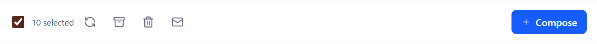
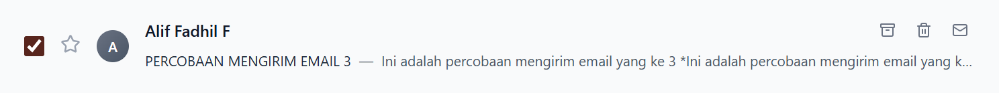

# Bulk Select & Toolbar

## Deskripsi

Memungkinkan pemilihan banyak email dan menyediakan toolbar aksi (Archive/Delete/Mark-as-read). Saat ini aksi belum mengubah data global.

## Fungsionalitas

- `Select All` dan pemilihan individual.
- Tombol aksi (UI) untuk Archive/Delete/Mark-as-read.

## Alur Pengguna

1. Centang `Select All` atau pilih item satu per satu.
2. Tekan tombol aksi di toolbar.
3. (Saat ini) Tidak ada perubahan data nyata karena belum ada state global/API.

## Komponen React yang Terlibat

- `src/components/layout/EmailLayout.jsx` (state seleksi)
- `src/components/email/EmailList.jsx` (toolbar)
- `src/components/email/EmailItem.jsx` (checkbox per item)

## State / Context yang Digunakan

- `EmailLayout`: `selectedEmails`, `selectAll`.
- `EmailList`: `showMoreActions` (mobile).
- **Tidak ada Context global**.

## API Terkait (jika ada)

- Tidak ada.

## Validasi & Error

- Tidak ada.

## Status

- [x] Belum selesai (aksi yang memodifikasi data)

## Screenshot

- Tampilan Toolbar

  > 

- Tampilan Toolbar Email Item

  > 
