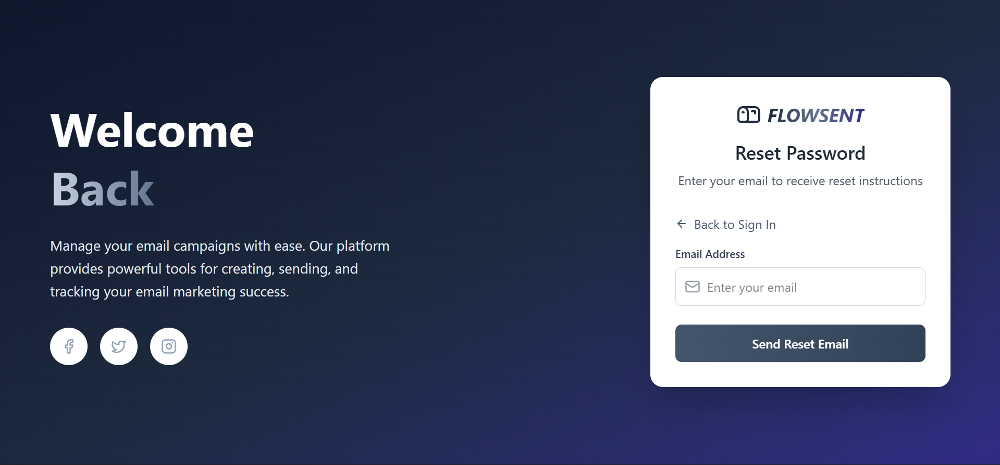

# Authentication — Login

## Deskripsi

Fitur login menyediakan proses autentikasi user ke aplikasi. UI login menangani masukan email/password, validasi sederhana, dan mengirim request ke backend `/api/login`. Setelah login sukses, token disimpan (localStorage) dan pengguna diberi akses ke area aplikasi yang dilindungi.

## Fungsionalitas

- Input email dan password
- Validasi sederhana (email non-empty, password non-empty)
- Submit form ke `POST /api/login`
- Menampilkan error message dari server jika autentikasi gagal
- Menyimpan token di localStorage dan mengarahkan ke halaman utama jika sukses
- Fitur **"Forgot password"** — tampilan UI section untuk mengirim reset email (UI tersedia), tetapi backend endpoint untuk reset belum ada.

## Alur Pengguna

1. Pengguna membuka `/login`
2. Masukkan email dan password
3. Tekan tombol **Login**
4. Frontend mengirim `POST /api/login` dengan JSON `{ email, password }`
5. **Jika berhasil:**
   - Simpan token ke localStorage
   - Redirect ke halaman utama
6. **Jika gagal:**
   - Tampilkan pesan error pada UI

## Komponen React yang Terlibat

- `src/pages/LoginPage.jsx` — komponen halaman login
- **Ikon dan elemen UI:** beberapa icon dari `lucide-react` dipakai

## State / Context yang Digunakan (null)

## API Terkait

- **POST** `http://127.0.0.1:8000/api/login`

## Validasi & Error

- **Validasi minimal di client:** cek non-empty
- **Jika response !ok:** `data.message` digunakan untuk menampilkan error
- **Jika terjadi network error:** tampilkan pesan umum

## Status

- [ ] Selesai

## Screenshot

- Tampilan Form Login

  > 

- Tampilan Form Forget Password

  > 
