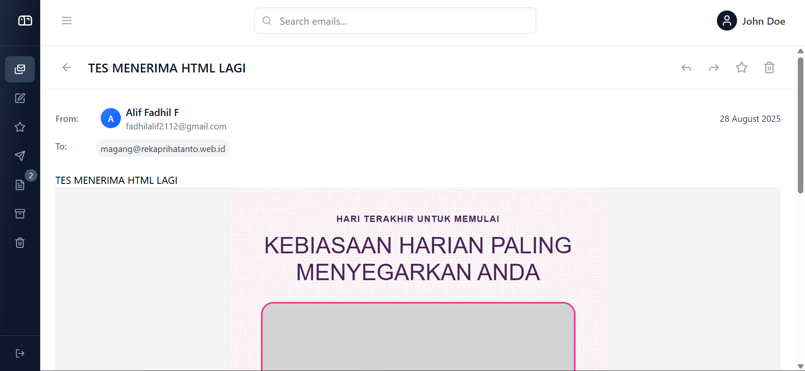

# Email Detail

## Deskripsi

Halaman untuk menampilkan isi lengkap sebuah email, lampiran, dan aksi cepat (reply, forward, archive, delete, download attachment).

## Fungsionalitas

- Menampilkan header email (From, To, Date, Subject).
- Menampilkan body email (plain text / HTML fallback).
- Menampilkan daftar lampiran dengan ikon berdasarkan ekstensi.
- Aksi toolbar: Reply, Forward, Archive, Delete, Download, Star, dsb. (\*baru sekedar UI)
- Tombol kembali (arrow back) menuju list.

## Alur Pengguna

1. Dari daftar email, klik salah satu item → navigasi ke `/folder/:uid` (contoh `/inbox/14`).
2. `EmailDetailPage.jsx` mencari email dari `EmailContext.emails` berdasarkan folder dan uid.
3. Jika ditemukan, `EmailDetail` menampilkan data; jika tidak, tampilkan placeholder/404 kecil atau `EmailDetail` akan menampilkan not-found.

## Komponen React yang Terlibat

- `src/pages/EmailDetailPage.jsx`
- `src/components/email/EmailDetail.jsx`

## State / Context yang Digunakan

- `useEmails()` dari `src/context/EmailContext.jsx` untuk mendapatkan semua email.
- Local state di `EmailDetailPage` untuk `email` dan `loading`.

## API Terkait

- Data email berasal dari `EmailContext` (yang mem-fetch `GET /api/emails/all`).

## Validasi & Error

- Jika `emails` belum ter-load (`emailsLoading`), `EmailDetailPage` menampilkan `EmailDetail loading`.
- Jika email tidak ditemukan (uid tidak match), `EmailDetailPage` meng-set `email = null` — tampilkan pesan atau redirect sesuai implementasi.

## Status

- [x] **Belum selesai**: Aksi Toolbar belum diimplementasikan

## Screenshot

- Tampilan Detail Email

  > 
