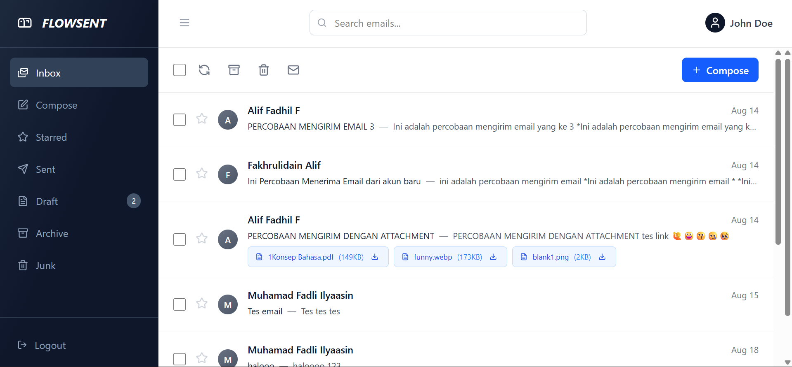

# Inbox (Daftar Email Masuk)

## Deskripsi

Halaman untuk menampilkan daftar email di folder `inbox`. Menggunakan `EmailLayout` yang menampilkan toolbar, daftar email, seleksi, dan aksi cepat (archive, delete, download, dsb).

## Fungsionalitas

- Menampilkan daftar email (subject, sender, preview, timestamp)
- Centang multi-select untuk melakukan aksi massal
- Tombol aksi massal: Star, Archive, Move to Trash (baru sekedar UI saja)
- Tombol seleksi semua (Select All)
- Tombol Refresh untuk Fetch ulang
- Klik pada email membuka halaman detail (`/inbox/:uid`)
- Menampilkan state loading saat data sedang diambil

## Alur Pengguna

1. Buka route `/` atau `/inbox` (route root diarahkan ke `InboxPage`)
2. EmailLayout (melalui `useEmails`) memuat email untuk folder `inbox`
3. **Pengguna bisa:**
   - Klik checkbox tiap item untuk memilih
   - Klik checkbox select-all untuk memilih semua
   - Gunakan toolbar untuk melakukan aksi
   - Klik sebuah email untuk melihat detail

## Komponen React yang Terlibat

- `src/pages/InboxPage.jsx` — page wrapper (memanggil `EmailLayout`)
- `src/components/layout/EmailLayout.jsx` — menangani pengambilan daftar folder dan manajemen seleksi
- `src/components/email/EmailList.jsx` — toolbar + kontainer daftar email
- `src/components/email/EmailItem.jsx` — representasi tiap email di list

## State / Context yang Digunakan

### EmailContext

- `EmailContext` (`src/context/EmailContext.jsx`) menyediakan `emails`, `loading`, `error`, dan `refreshEmails`

## API Terkait

- **GET** `http://127.0.0.1:8000/api/emails/all` (dipanggil oleh `EmailContext`)
  - `EmailContext` memecah data ke folder-folder (inbox, sent, draft, archive, starred, deleted/junk)

## Validasi & Error

### Authentication Error (401)

- Jika `EmailContext` mendapatkan status `401` dari API:
  - Token dihapus dari `localStorage`
  - Redirect ke `/login`

### Token Validation

- Jika token tidak ditemukan: alert + redirect ke login

### Loading State

- UI menampilkan indikator loading (`loading` true)

## Status

- [x] **Belum selesai** — aksi toolbar ke backend belum di implementasi

## Screenshot

- Tampilan Inbox Page

> 
